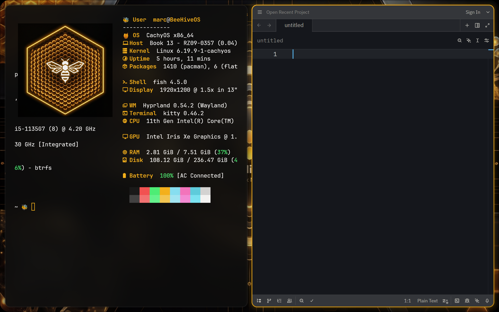
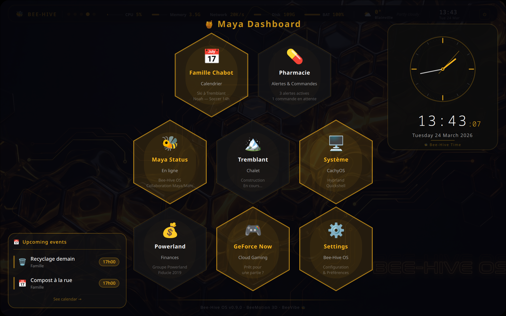
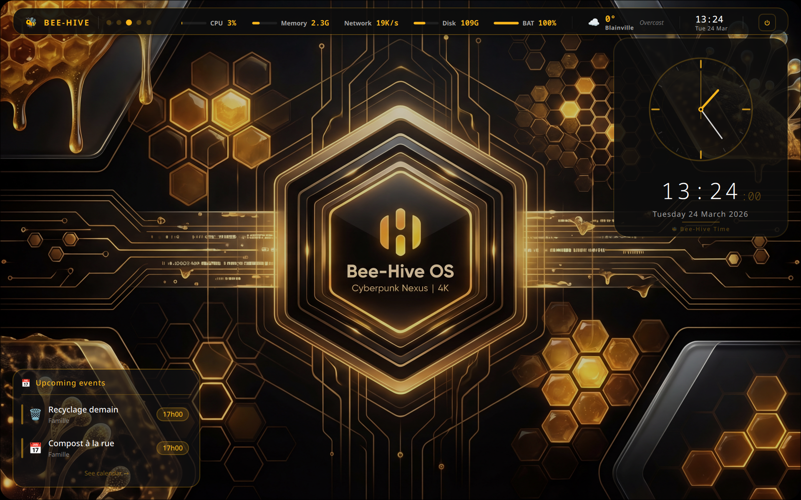
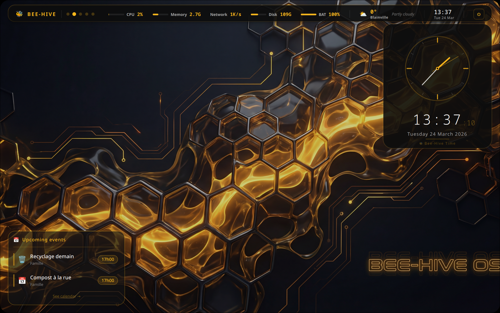
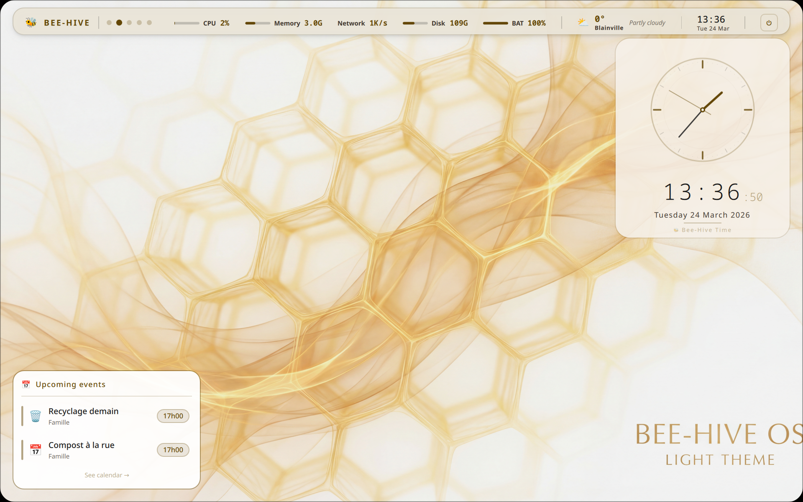
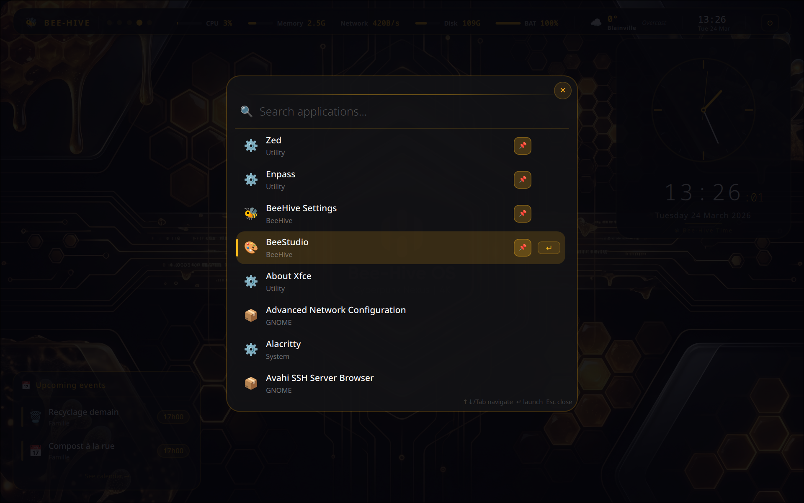
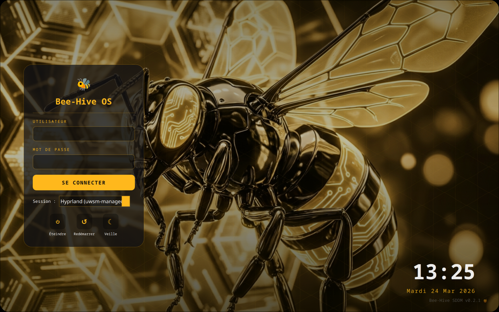

# 🐝 Bee-Hive OS

> Ambitious desktop environment (*ricing*) based on **Quickshell** (QML/Qt6) for **CachyOS + Hyprland**.
> "Nexus" aesthetic: honey yellow 🍯 on deep black, organic animations, glassmorphism, and "BeeAura" glow.

---

## 🍯 Showcase — The Visual Nectar

### 🛡️ The Welcome Screen


### 🍯 The MayaDash (Honeycomb Dashboard)


### 📊 System Widgets (Clock & Events)


### 🌙 Cyber-Amber (Dark Theme)


### 💻 Tiling Mode (Kitty + Zed)


### 🍯 Honey-Veil (Light Theme)


### 🔍 Search & Launcher


### ⏻ Login Screen (SDDM)


---

## ⚠️ REQUIRED — Hyprland Keybinds

**Without these, Bee-Hive OS won't respond to any keyboard shortcut.**

Add this single line to your `~/.config/hypr/hyprland.conf` :

```ini
source = ~/beehive_os/config/beehive_keybinds.conf
```

This enables all core shortcuts:

| Keybind | Action |
|---------|--------|
| `Super + D` | 🍯 Toggle Dashboard (MayaDash) |
| `Super + Space` | 🔍 App Launcher (BeeSearch) |
| `Super + Escape` | ⚙️ The Hive (Control Center) |
| `Super + P` | ⏻ Power Menu |
| `Super + F12` | 🌙 Toggle HoneyDark / HoneyLight |

> 💡 **First launch tip:** Bee-Hive OS will show a welcome screen on first run with these instructions built-in!

---

## 🏗️ Architecture

```
beehive_os/
├── shell.qml                 # Compatibility entrypoint (loads core/BeeHiveShell.qml)
├── core/
│   └── BeeHiveShell.qml      # Main ShellRoot composition
├── modules/
│   ├── BeeModuleRegistry.qml # Stable registration API for BeeBar/MayaDash modules
│   └── ...
├── themes/
│   └── theme.json            # Visual identity centralization
├── docs/
│   ├── ROADMAP.md
│   ├── REFERENCES.md
│   └── MODULE_API.md
├── scripts/
│   └── bee_theme_auto.py
├── assets/                   # 4K wallpapers and graphical assets
└── user_config.json          # Persistent user configuration
```

### Internal API

- BeeBar / MayaDash module registration spec: `docs/MODULE_API.md`
- Contributor workflow and CachyOS install path: `CONTRIBUTING.md`

### Legacy Modules Map

```
modules/
    ├── BeeBar.qml            # Status bar (CPU, RAM, NET, DISK) + Stealth Mode
    ├── BeeBarState.qml       # Inter-window communication singleton
    ├── BeeApps.qml           # Application manager (Scan & Favorites)
    ├── BeeConfig.qml         # Config singleton (weather, dashboard, theme, persistence)
    ├── BeeNotify.qml         # "In-Shell" notification system
    ├── BeeWallpaper.qml      # Dynamic wallpaper manager
    ├── BeeWeather.qml        # Universal weather (Open-Meteo, no API key)
    ├── BeeEvents.qml         # Events connector (Calendar/Work)
    ├── BeeCorners.qml        # Organic screen corner rendering
    ├── BeeSettings.qml       # Configuration panel (GUI)
    ├── BeeStudio.qml         # Visual cell editor (Full persistence)
    ├── BeeSearch.qml         # Application launcher (Fuzzy search + Pins)
    ├── BeeVibe.qml           # Discreet audio visualizer (Cava integration)
    ├── BeePower.qml          # Power management (Shutdown, Reboot, Lock, Exit)
    ├── MayaDash.qml          # Hexagonal dashboard (Honeycomb)
    ├── BeeNotes.qml          # Quick Notes (PanelWindow + text persistence)
    └── Clock.qml             # Analog + digital clock widget
```

---

## 📦 Modules

### BeeWeather — Universal Weather 🌦️ *(v0.6.3)*
- **No API Key**: Uses Open-Meteo for accurate weather data
- **Centralized Coordinates**: `BeeConfig.weatherLat/Lon`
- **Persistence**: City, unit, and language saved in `user_config.json`
- **Synchronized**: No more divergence between the widget and the BeeBar

### BeeAura Notifications & OSD 🔔 *(v1.0.0)*
- **100% Native**: Notification system and OSD (Volume/Brightness) integrated without external dependencies.
- **Zero Mouse Capture**: Uses the official `mask: Region {}` property for full click-through on transparent areas.
- **BeeNotify**: Full support for system notifications via `beenotifier.py`.
- **BeeOSD**: Elegant visual feedback for hardware (Razer Keyboard/Mouse).

### BeePower — Power Management ⚡ *(v1.0.0)*
- **BeeAura Interface**: Dedicated menu accessible via ⚡ in the BeeBar
- **System Actions**: Shutdown, Reboot, Logout, Lock

### BeeSearch — Application Launcher 🔍 *(v1.0.0)*
- **System Scan**: Parses `.desktop` files via Python
- **Favorites 📌**: Up to 4 pinned apps, persistent in `user_config.json`

### BeeVibe — Audio Visualizer 🎵 *(v0.8.4)*
- **Equalizer Bars** integrated at the bottom of each MayaDash cell
- **Cava Engine**: Captures system audio via Pipewire/Pulse

### BeeStudio — Visual Editor 🎨 *(v0.8.4)*
- **Live Editing**: Icons, titles, and cell actions with immediate preview
- **Persistence** directly in `user_config.json`

### Stealth Mode 🫥 *(v0.8.3)*
- **Auto-Hide**: BeeBar fades out after 3 seconds of inactivity
- **Sentinel**: Invisible window at the top detects mouse hover

### BeeMotion — 3D Parallax 🌊 *(v0.8.0)*
- 3D tilting of the MayaDash based on mouse position

### BeeBar — Status Bar ⚡
- CPU, RAM, NET, DISK in real-time
- Progress bars with animations and adaptive glow

### BeeNotes — Quick Notes 📝 *(v2.1)*
- **PanelWindow**: Dedicated focusable panel (WlrLayer.Top) with semi-transparent overlay
- **Persistence**: Notes saved to `data/notes.txt` (timestamp|color|text format)
- **Interactive**: Add, edit, delete notes with color-coded cards
- **Close Button**: ✕ button + click-outside-to-close
- **i18n**: Full English/French localization via BeeConfig.tr

### BeeEvents — Events Hub 📅 *(v0.7.0)*
- Centralizes calendar events and professional alerts

---

## 🍯 Honey-Sync — Live Calendar 📅 *(NEW)*

Bee-Hive OS includes two local scripts to fetch your Calendar events and display them in the MayaDash.

### Method 1: The Universal Way (ICS/iCalendar) - Recommended
Works with Google, Outlook, iCloud, Fastmail, and any calendar that supports secret `.ics` links. No auth required!

1. Open `user_config.json` and add your secret iCal link:
   ```json
   "events_ics_url": "https://calendar.google.com/calendar/ical/your-secret-link/basic.ics",
   "events_enabled": true
   ```
2. Sync your nectar:
   ```bash
   python3 scripts/honey_sync_ics.py
   ```

### Method 2: The Google Workspace CLI (gog)
If you prefer a direct authenticated API connection without sharing `.ics` links.

1. **Install `gog` CLI**:
   ```bash
   # Arch Linux / CachyOS
   yay -S gogcli
   
   # Or via Go
   go install github.com/steipete/gogcli/cmd/gog@latest
   ```

2. **Setup OAuth Credentials**:
   To connect to Google, `gog` requires a Desktop App OAuth Client ID.
   *   Go to Google Cloud Console > Credentials > Create "Desktop app" OAuth Client.
   *   Download the JSON file.
   *   Provide it to `gog`:
       ```bash
       gog auth credentials path/to/downloaded/client_secret.json
       ```

3. **Authorize `gog`** with your Google account:
   ```bash
   gog auth login
   ```

4. **Sync your nectar**:
   ```bash
   python3 scripts/honey_sync.py
   ```

*(Optional) Add a cron job or systemd timer to run either script every hour!*

---

## 🎨 Design System — BeeAura (Nexus)

| Element       | Value                               |
|---------------|-------------------------------------|
| Primary Gold  | `#FFB81C` (Honey Gold)             |
| Dark Background| `rgba(0.05, 0.05, 0.07, 0.95)`     |
| Surface       | `rgba(255, 255, 255, 0.03)`         |
| Animations    | `Easing.InOutCubic` / `OutBack`    |

---

## 🚀 Usage

```bash
# Requirements: CachyOS + Hyprland + Quickshell (Qt6) + Cava + Python-DBus
QML_XHR_ALLOW_FILE_READ=1 quickshell -p ~/beehive_os
```

## 🧪 Auto Theme From Wallpaper (Matugen-like)

- Generator script: `scripts/bee_theme_auto.py`
- Overlay output: `user_config.auto.json`
- Runtime merge rule: `user_config.json` (base) + `user_config.auto.json` (theme-only overlay)

### Generate Manually

```bash
python3 scripts/bee_theme_auto.py --wallpaper /absolute/path/to/wallpaper.png --output user_config.auto.json
```

Or force mode while keeping wallpaper-derived palette:

```bash
python3 scripts/bee_theme_auto.py --wallpaper /absolute/path/to/wallpaper.png --mode HoneyLight
```

### Runtime Behavior

- If `user_config.auto.json` is missing: Bee-Hive starts with base config only.
- If overlay JSON is invalid: Bee-Hive logs a warning and falls back to base config.
- Only theme-related keys are overlaid (`theme`, `auto_theme.palette`); dashboard/apps/calendar preferences remain in `user_config.json`.
- In BeeStudio, selecting a wallpaper triggers auto-theme generation (deduplicated), and the action button can force re-apply.

### Troubleshooting

- Ensure `python3` is available in PATH.
- Ensure wallpaper path is valid and readable.
- If generation fails, check Quickshell logs for `BeeThemeAuto:` lines and retry with the BeeStudio action button.

## 🛠️ Installation & Update System

### 🚀 First-Time Installation

For a complete installation on CachyOS + Hyprland:

```bash
# Clone the repository
git clone https://github.com/marcchabot/beehive_os.git
cd beehive_os

# Run the installation script
chmod +x scripts/install_beehive_os.sh
./scripts/install_beehive_os.sh
```

### 🔄 Safe Update Procedure

**⚠️ IMPORTANT:** Always follow this procedure after `git pull` to avoid system breakage:

```bash
# 1. Backup and update
./scripts/update.sh

# 2. Run health check
./scripts/health-check.sh

# 3. If health check passes, restart
QML_XHR_ALLOW_FILE_READ=1 quickshell -p ~/beehive_os
```

### 📋 Available Maintenance Scripts

| Script | Purpose | When to use |
|--------|---------|-------------|
| `install_beehive_os.sh` | Complete first-time installation | New installation |
| `update.sh` | Safe post-update maintenance | After every `git pull` |
| `health-check.sh` | System diagnostic | When things don't work |
| `post-update.sh` | Automatic migrations | Internal use by update.sh |
| `update_icons.py` | Desktop icon automation | Manual icon updates |

### 🏥 Health Check

Run a comprehensive system diagnostic:
```bash
./scripts/health-check.sh
```

This will check:
- ✅ System dependencies
- ✅ File structure
- ✅ Permissions
- ✅ Configuration validity
- ✅ Runtime functionality

### 🚨 Emergency Recovery

If Bee-Hive OS breaks after an update:
```bash
# 1. Check system health
./scripts/health-check.sh

# 2. Review warnings/failures

# 3. Restore from backup (created by update.sh)
cp ~/.beehive_backup/latest/user_config.json .

# 4. Re-run update
./scripts/update.sh
```

---

## 📜 License

This project is licensed under the **MIT** license. See the [LICENSE](LICENSE) file for details.

---

### 🐝 Updating the Hive
To update without losing your personal settings (cells, weather, pinned apps):
1. `git pull`
2. `python3 scripts/bee_config_merge.py`
3. Restart the hive: `qs ipc call root restart` (or restart Quickshell)

---

## 📋 Roadmap

### ✅ Completed

- [x] BeeBar — CPU/RAM/NET/DISK + Stealth Mode
- [x] BeeNotify — Stylized notifications
- [x] BeeCorners — Fake Rounding engine
- [x] BeeWallpaper — Fluid transitions + 4K Assets
- [x] BeeSettings — Configuration interface
- [x] BeeWeather — Universal weather without API key (v0.6.1)
- [x] BeeEvents — Calendar connectors (v0.7.0)
- [x] BeeMotion — 3D Parallax (v0.8.0)
- [x] BeeStudio — Full visual editor (v0.8.4)
- [x] BeeSearch — System scan + Favorites 📌 (v0.8.4)
- [x] BeeVibe — Cava audio visualizer (v0.8.4)
- [x] Stealth Mode — Auto-hide with sentinel (v0.8.3)
- [x] BeePower — Power management ⚡ (v0.8.5)
- [x] **BeeAura Notifications & OSD** — 100% native Quickshell system (v1.0.0)
- [x] Nectar Sync 🍯 — Automatic theme adaptation to wallpaper (v1.3.0)
- [x] **Multilingual Support (i18n)** — Full French/English localization (v2.0.0)
- [x] **BeeNotes — Quick Notes** — PanelWindow + Persistence + i18n (v2.1) 📝

### 🔄 In Progress / Upcoming

- [ ] Bee-Hive sound effects (discreet and elegant)
- [ ] "Focus" Mode vs "Dashboard" Mode
- [ ] Performance optimization (Quickshell profiling)
- [x] Persistent notifications widget (v2.1) 🐝📜

---

## 🐝 Credits

Developed with love by **Maya** 🐝✨ & **Marc**.

*"The hive never sleeps, it optimizes."* 🍯🚀
